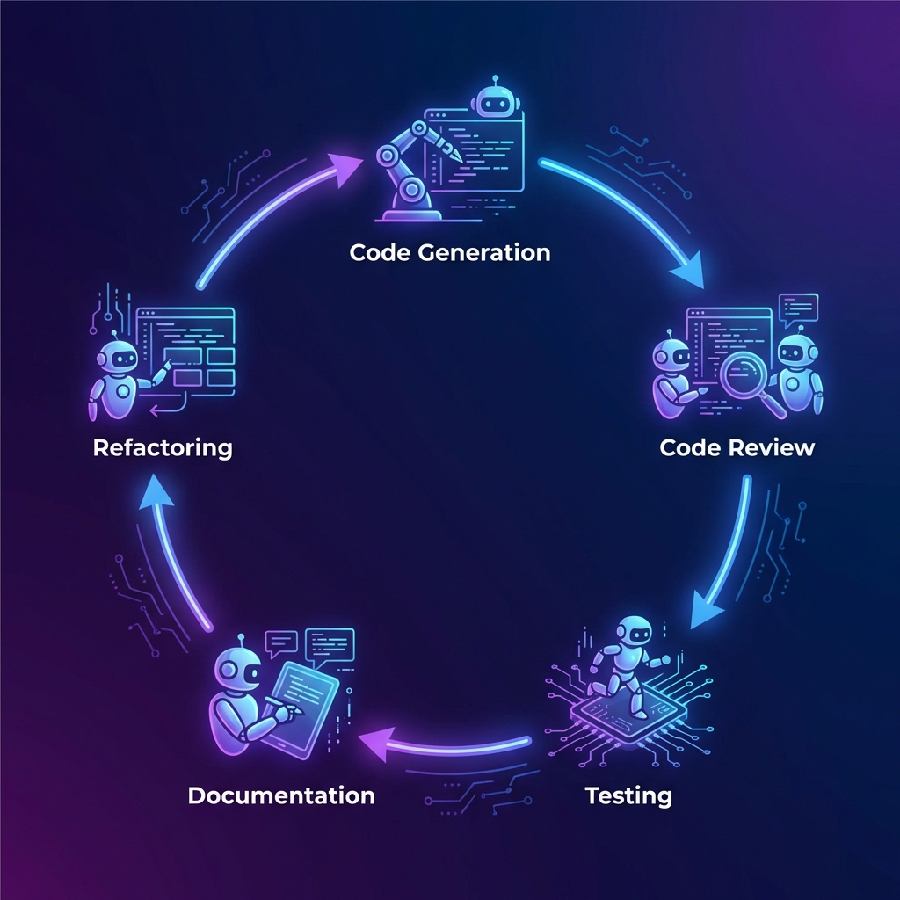

# Dev Agents 🤖


<p align="center">
  
</p>

AI-powered agents for software engineers, running **100% locally** with Ollama.

---

## ✨ Features

<p align="center">
  
</p>

| Agent | Description |
|-------|-------------|
| 💻 **Code Generator** | Generate code from natural language |
| 🔍 **Code Reviewer** | Review code for bugs and best practices |
| 🐛 **Bug Detective** | Debug issues and find root causes |
| 🧪 **Test Generator** | Generate unit and integration tests |
| 📚 **Doc Writer** | Generate documentation and README files |
| ⚙️ **Refactoring Expert** | Suggest code improvements |

---

## 🔒 100% Local

<p align="center">
  
</p>

- ✅ No cloud API costs
- ✅ Data never leaves your machine
- ✅ Works offline
- ✅ Fast responses

---

## 📋 Prerequisites

- **Python 3.10-3.13**
- **Ollama** installed and running
- A coding model: `ollama pull codellama:13b`

---

## 🚀 Installation

```bash
# Install dependencies
uv sync

# Copy environment template
cp example.env .env
```

---

## 💻 Usage

### Generate Code

```bash
uv run dev_agents generate "Create a FastAPI endpoint for user auth"
```

### Review Code

```bash
uv run dev_agents review ./src/main.py
```

### Debug Code

```bash
uv run dev_agents debug ./src/app.py -e "TypeError: expected str"
```

### Generate Tests

```bash
uv run dev_agents test ./src/utils.py -f pytest
```

### Generate Documentation

```bash
uv run dev_agents docs ./src/api.py -t readme
```

### Suggest Refactoring

```bash
uv run dev_agents refactor ./src/legacy.py -f performance
```

---

## ⚙️ Configuration

Edit `.env` to configure:

```env
# Ollama settings
OLLAMA_BASE_URL=http://localhost:11434
OLLAMA_MODEL=codellama:13b

# Optional OpenAI fallback
# OPENAI_API_KEY=your-key-here
```

---

## 📁 Project Structure

```text
.
├── src/dev_agents/
│   ├── agents/           # 6 AI agent implementations
│   ├── config/           # YAML configurations
│   ├── tools/            # Utility tools
│   ├── crew.py           # Multi-agent orchestration
│   ├── llm_config.py     # LLM configuration
│   └── main.py           # CLI entry point
├── assets/               # Images
└── README.md
```

---

## 🛠️ Tech Stack

- **CrewAI** - Multi-agent orchestration
- **Ollama** - Local LLM runtime
- **LangChain** - LLM framework
- **Python 3.10+** - Core language

