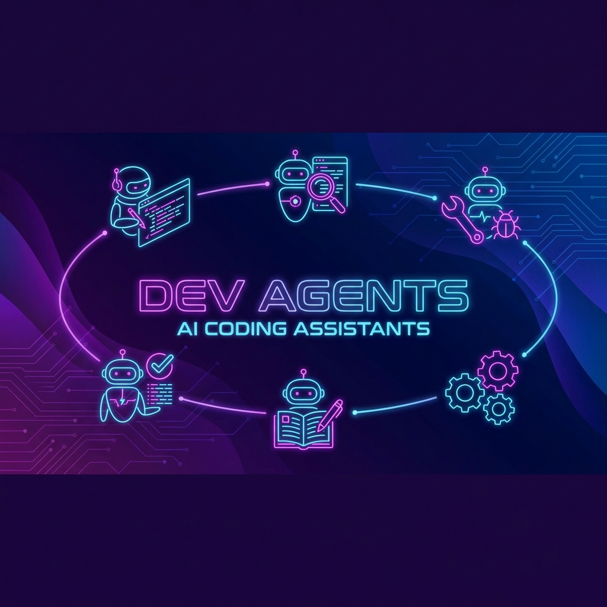
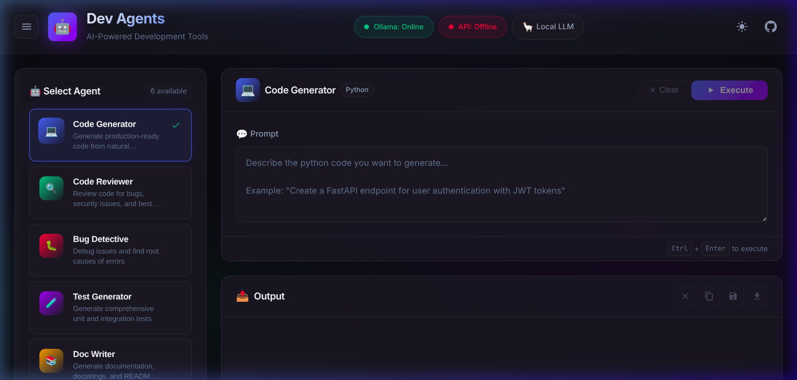
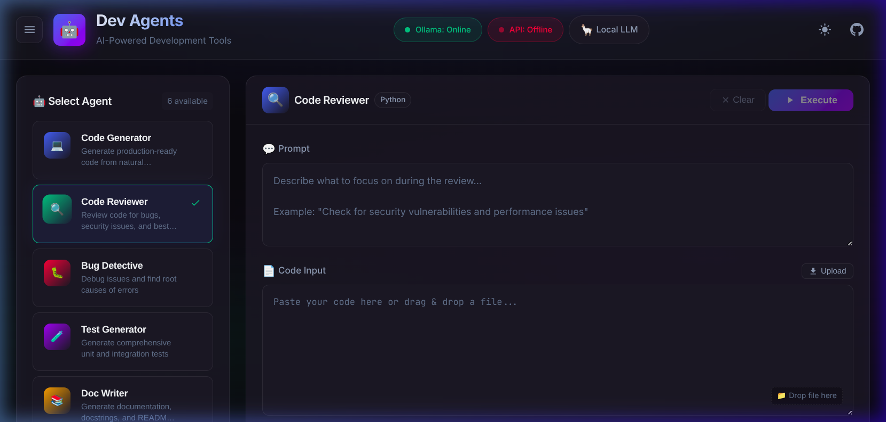
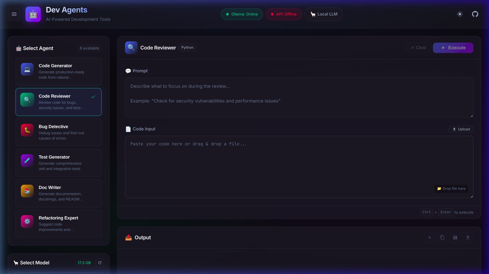
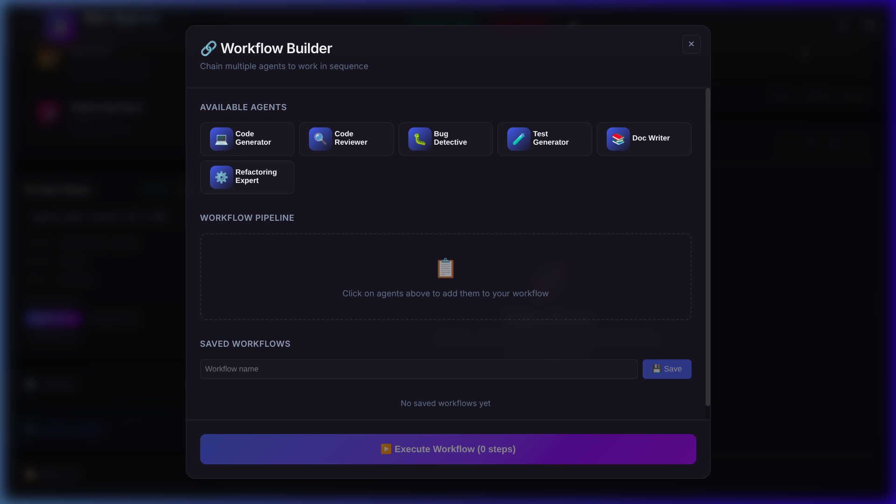
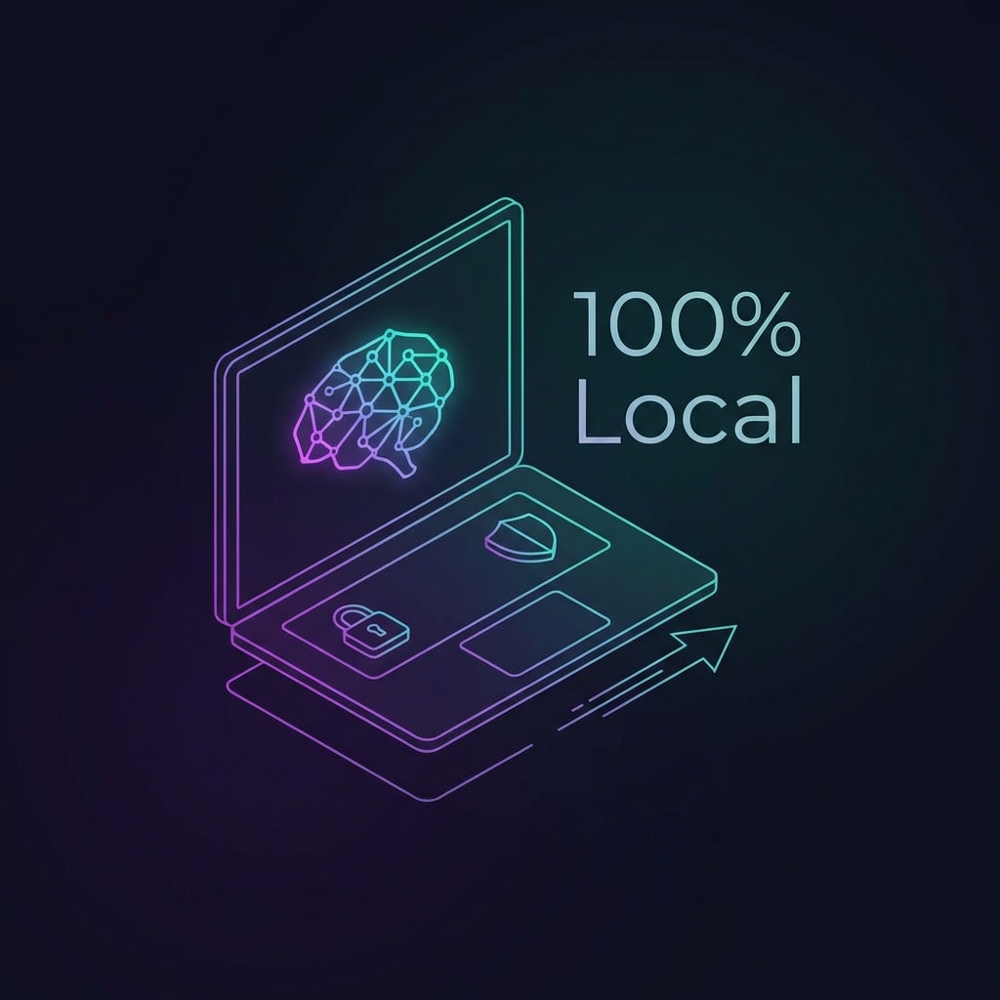

# Dev Agents 🤖


<p align="center">
  
</p>

AI-powered agents for software engineers, running **100% locally** with Ollama.

---

## ✨ Features

### 🖥️ Dashboard

<p align="center">
  
</p>

### 🔍 Code Reviewer

<p align="center">
  
</p>

### 🤖 Agent Selection & Model Picker

<p align="center">
  
</p>

### 🌊 Workflow Builder

<p align="center">
  
</p>

| Agent | Description |
|-------|-------------|
| 💻 **Code Generator** | Generate code from natural language |
| 🔍 **Code Reviewer** | Review code for bugs and best practices |
| 🐛 **Bug Detective** | Debug issues and find root causes |
| 🧪 **Test Generator** | Generate unit and integration tests |
| 📚 **Doc Writer** | Generate documentation and README files |
| ⚙️ **Refactoring Expert** | Suggest code improvements |

---

## 🔒 100% Local

<p align="center">
  
</p>

- ✅ No cloud API costs
- ✅ Data never leaves your machine
- ✅ Works offline
- ✅ Fast responses

---

## 📋 Prerequisites

- **Python 3.10-3.13**
- **Ollama** installed and running
- A coding model: `ollama pull codellama:13b`

---

## 🚀 Installation

```bash
# Install dependencies
uv sync

# Copy environment template
cp example.env .env
```

---

## 💻 Usage

### Generate Code

```bash
uv run dev_agents generate "Create a FastAPI endpoint for user auth"
```

### Review Code

```bash
uv run dev_agents review ./src/main.py
```

### Debug Code

```bash
uv run dev_agents debug ./src/app.py -e "TypeError: expected str"
```

### Generate Tests

```bash
uv run dev_agents test ./src/utils.py -f pytest
```

### Generate Documentation

```bash
uv run dev_agents docs ./src/api.py -t readme
```

### Suggest Refactoring

```bash
uv run dev_agents refactor ./src/legacy.py -f performance
```

---

## 🖥️ Web Dashboard

A modern React UI for managing agents visually:

```bash
# Terminal 1: Start the API server
uv sync  # Install new dependencies
uv run uvicorn dev_agents.api:app --reload --port 8000

# Terminal 2: Start the React frontend
cd frontend
npm install
npm run dev
```

Open **http://localhost:5173** to access the dashboard.

### Dashboard Features
- 🤖 **Agent Selection** - Choose from 6 specialized agents
- 🦙 **Model Picker** - Switch between your local Ollama models
- 📝 **Rich Input** - Context-aware input fields per agent type
- 📤 **Live Streaming** - Real-time output with thinking indicators
- 📜 **History** - Track and restore previous executions

---

## ⚙️ Configuration

Edit `.env` to configure:

```env
# Ollama settings
OLLAMA_BASE_URL=http://localhost:11434
OLLAMA_MODEL=codellama:13b

# Optional OpenAI fallback
# OPENAI_API_KEY=your-key-here
```

---

## 📁 Project Structure

```text
.
├── src/dev_agents/
│   ├── agents/           # 6 AI agent implementations
│   ├── config/           # YAML configurations
│   ├── tools/            # Utility tools
│   ├── crew.py           # Multi-agent orchestration
│   ├── llm_config.py     # LLM configuration
│   └── main.py           # CLI entry point
├── frontend/             # React dashboard origin
│   ├── src/              # Frontend source code
│   └── package.json      # Frontend dependencies
├── assets/               # Images
└── README.md
```

---

## 🛠️ Tech Stack

- **CrewAI** - Multi-agent orchestration
- **Ollama** - Local LLM runtime
- **LangChain** - LLM framework
- **Python 3.10+** - Backend language
- **React + Vite** - Frontend dashboard

---

## 📚 Learning Resources

| Guide | Description |
|-------|-------------|
| [**CrewAI & LangChain Guide**](./docs/crewai-langchain-guide.md) | Comprehensive tutorial covering LangChain fundamentals, CrewAI architecture, integration patterns, and best practices |
| [**Uber System Design**](./docs/uber-system-design.md) | Complete architecture deep-dive: microservices, dispatch system (DISCO), H3 geospatial indexing, Kafka streaming, surge pricing, and fraud detection |

Learn how to build AI agents from scratch with our detailed guide covering:
- 🔗 **LangChain**: Models, Prompts, Chains, Memory, and Agents
- 🚀 **CrewAI**: Agents, Tasks, Crews, and Process types
- 🔄 **Integration**: Using LangChain tools within CrewAI
- ✅ **Best Practices**: Agent design, performance tips, and production deployment

### System Design Resources
Master large-scale distributed systems with our Uber system design guide:
- 🏗️ **Architecture Evolution**: Monolith to microservices journey
- 📍 **H3 Geospatial**: Hexagonal indexing for location services
- 📊 **Kafka Streaming**: 138M messages/second real-time processing
- 💰 **Surge Pricing**: Dynamic pricing algorithms
- 🔐 **Fraud Detection**: ML-powered security systems
